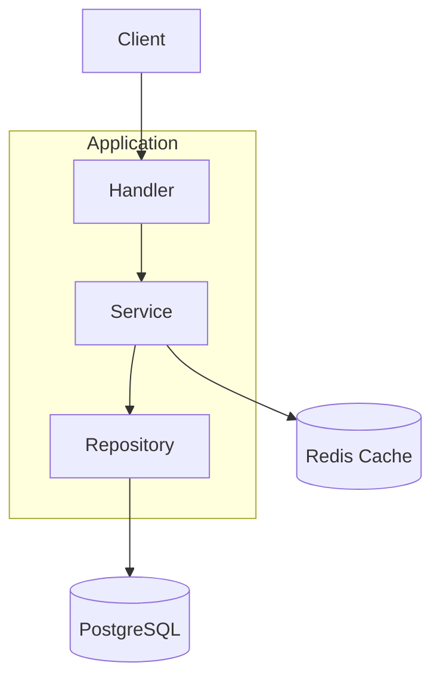

# Go Users API

REST API built with Go, PostgreSQL, Redis and Docker, following a layered (clean) architecture.

This project demonstrates how to build a scalable backend with caching, proper separation of concerns, and production-ready patterns.

---

## Tech Stack

* Go
* Chi Router
* PostgreSQL
* Redis (caching)
* Docker & Docker Compose
* Swagger (API documentation)

---

## Features

- Layered architecture (Handler / Service / Repository)
- Redis caching for performance optimization
- PostgreSQL as primary database
- Graceful shutdown
- Middleware (logging & recovery)
- Swagger API documentation
- Dockerized environment

---

## Architecture

The project follows a layered architecture:

### Layers

- **Handler** → HTTP layer
- **Service** → Business logic + cache handling
- **Repository** → Database access
- **PostgreSQL** → Primary database
- **Redis** → Cache layer

---

## Architecture Diagram


---

## Environment Variables

Create a .env file:

```env
DATABASE_URL=postgres://user:password@db:5432/users?sslmode=disable
REDIS_ADDR=redis:6379
REDIS_PASSWORD=
PORT=8080
```
---

## Run the Project with Docker

Clone the repository:

```bash
git clone https://github.com/Omen77796/go-users-api.git
cd go-users-api
docker compose up --build
```

The API will run at:

http://localhost:8080

---

## API Documentation (Swagger)

http://localhost:8080/swagger/index.html

---

## 🔌 API Endpoints

### Health

- **GET /health**

### Users

- **GET /users** → Get all users
- **GET /users/{id}** → Get user by ID
- **POST /users** → Create a new user
- **DELETE /users/{id}** → Delete a user
 
---

## API Usage Examples

### Health Check

Request

```bash
curl http://localhost:8080/health
```

Response

```json
{
  "status": "ok"
}
```

---

### Get All Users

Request

```bash
curl http://localhost:8080/users
```

Example response:

[
  {
    "id": 1,
    "name": "John",
    "email": "john@email.com"
  }
]

---

### Get User by ID

Request

```bash
curl http://localhost:8080/users/1
```

Example response:

{
  "id": 1,
  "name": "John",
  "email": "john@email.com"
}

---

### Create User

Request

```bash
curl -X POST http://localhost:8080/users \
-H "Content-Type: application/json" \
-d '{
  "name": "John",
  "email": "john@email.com"
}'
```

Example response:

{
  "id": 2,
  "name": "John",
  "email": "john@email.com"
}

---

## Delete User

```bash
curl -X DELETE http://localhost:8080/users/1
```
---

## Project Structure

```text
cmd/api              # Application entry point

internal/
  handlers/          # HTTP handlers
  services/          # Business logic
  repository/        # Database access
  middleware/        # Middleware
  models/            # Data models

init/
  init.sql           # Database initialization
```
---

## Maintainer

Omen77796 
